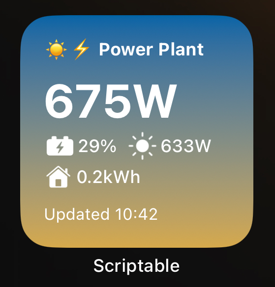
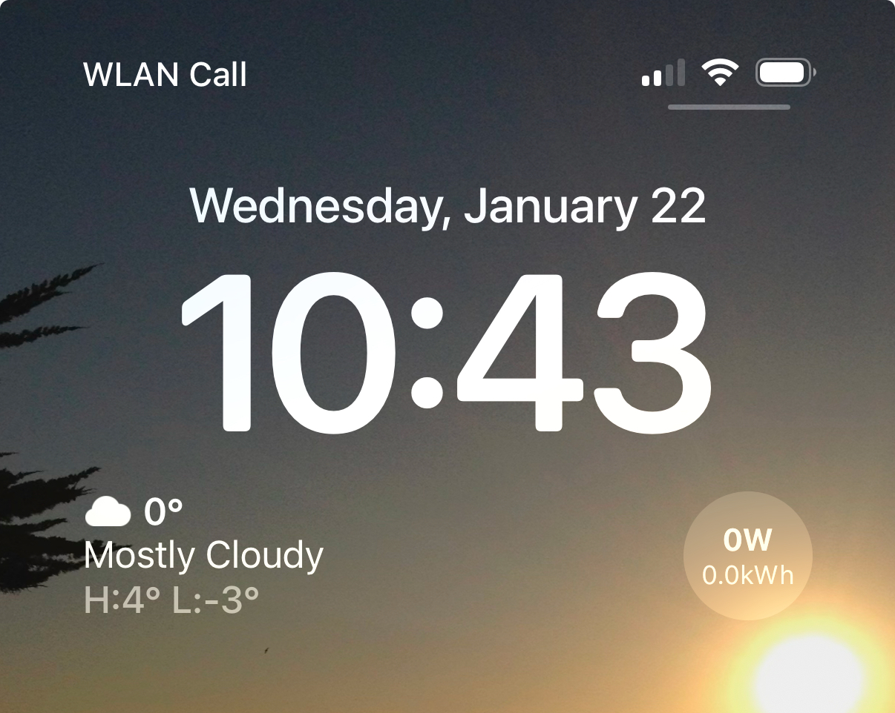

# homeassistant-solar-widget-scriptable

A widget for showing live solar and battery information from [Home Assistant](https://www.home-assistant.io) built with [Scriptable](http://scriptable.app).

## About

It currently provides a widget for the small cirular lock screen widgets (knowm as `accessoryCircular`) and small home screen widgets (known as `systemSmall`). 

## Shown data

The sytem small widget shows the most data:

- Current inverter output power
- Current battery SoC (plus a bolt indicator if the battery is not in standby)
- Current solar input power
- Energy sent to the home today (based on local time on your iOS device)

For the accessory circular widget the information is naturally a bit more condensed. It shows:

- Current inverter output power
- Energy sent to the home today

More widget types might be added in the future. PRs welcome.

## Installation & Configuration

1. Clone the repo
2. Fill in the access token and sensor IDs in the top of the [homeassistant-widget.js](homeassistant-widget.js)
3. Copy the `homeassistant-widget.js` into your Scriptable folder
4. Add a widget of the supported types, configure it with the `homeassistant-widget` 

